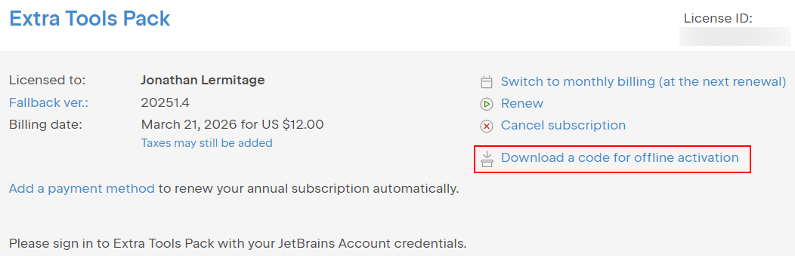
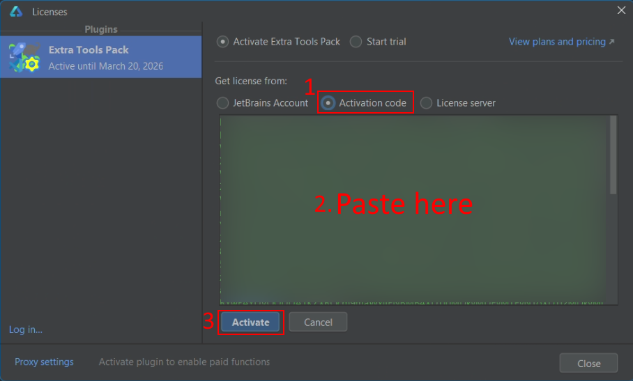

<show-structure for="chapter,procedure,tab,def"/>

# Huawei DevEco Studio

[Huawei DevEco Studio](https://developer.huawei.com/consumer/en/deveco-studio/) is the official IDE for Huawei's HarmonyOS operating system. It is based on IntelliJ IDEA Community (with some modifications) and includes additional features provided by Huawei.

## DevEco Studio support

DevEco Studio 5 (**at least version 5.1.1.850**) and DevEco Studio 6 (**at least version 6.0.1.251**) are officially supported by Extra Tools Pack, Extra Icons, Extra ToolWindow Colorful Icons and Extra IDE Tweaks.

<!--DevEco Studio 7 will also be officially supported once it's available outside from China. For now, you should be able to use it, but I can promise nothing.  
If you have access to DevEco Studio 6, I would be happy to read your feedback. At least, you would help me a lot by going to <ui-path>Help | About DevEco Studio | Copy and Close</ui-path>, paste to a text file, and send me this file (jonathan.lermitage AT gmail.com). This will tell me what's the base version of DevEco Studio (i.e. is it based in IntelliJ 2025 or 2026).-->

### Plugin installation

- Download the plugin file from the JetBrains marketplace website. The latest compatible versions are:
  - [Extra Tools Pack (2025.1.20.1-c)](https://plugins.jetbrains.com/plugin/24559-extra-tools-pack/versions/stable/902078)
  - [Extra Icons (2025.1.18.1-c)](https://plugins.jetbrains.com/plugin/11058-extra-icons/versions/stable/902076)
  - [Extra ToolWindow Colorful Icons (2025.1.16.1-c)](https://plugins.jetbrains.com/plugin/16604-extra-toolwindow-colorful-icons/versions/stable/902092)
  - [Extra ToolWindow Colorful Icons Lifetime (2025.1.16.1-c)](https://plugins.jetbrains.com/plugin/26404-extra-toolwindow-colorful-icons-lifetime/versions/stable/902093)
  - [Extra IDE Tweaks (2025.1.15.1-c)](https://plugins.jetbrains.com/plugin/23927-extra-ide-tweaks/versions/stable/902088)
  - [Extra IDE Tweaks Lifetime (2025.1.15.1-c)](https://plugins.jetbrains.com/plugin/27808-extra-ide-tweaks-lifetime/versions/stable/902081)
- Click on **Download**.
- Install the downloaded ZIP file manually in DevEco Studio: <ui-path>File | Settings | Plugins | Install Plugin from Disk...</ui-path>, and select the ZIP file.
- Restart DevEco Studio.

> My plugins are not listed in the plugin browser built into DevEco Studio because Huawei uses a whitelist of plugins. Only Huawei selects the plugins that figure in this whitelist, and 3rd-party plugin developers can't apply to be included on this list (as far as I know, and their support team doesn't help). This is why you have to install plugins manually.
> 
> I apologize for the inconvenience.
{style="warning"}

### License activation

You need to use an **offline activation code** because DevEco Studio does not support JetBrains authentication. To proceed:

- Visit your JetBrains profile: [https://account.jetbrains.com/licenses](https://account.jetbrains.com/licenses), scroll to the plugin you want to activate, and click on **Download a code for offline activation**. Open the downloaded ZIP file. It contains a text file: open it and copy its content. This is your offline activation code.
  
{ width="680" }

- In DevEco Studio, go to <ui-path>Help | Register Plugins...</ui-path>, select the plugin you want to activate, click on **Activation code**, then paste your offline activation code, click on **Activate**.

{ width="680" }

- Restart DevEco Studio.
  > Due to limitations of the JetBrains APIs, you may have to restart DevEco Studio twice the first time you activate your offline activation code. This scenario may happen one time only, and it can affect only the features from Extra ToolWindow Colorful Icons. Most users shouldn't face this issue. I apologize for the inconvenience.
