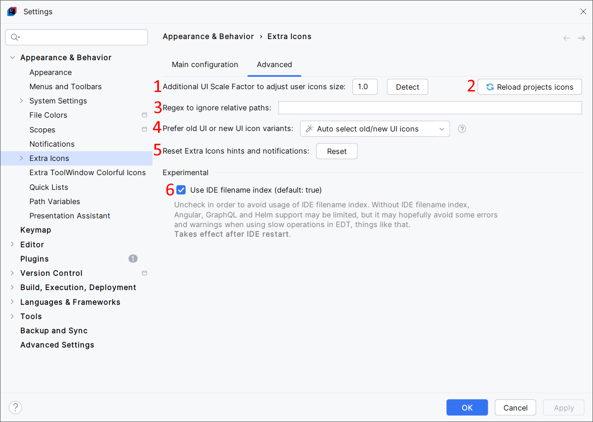

<show-structure for="chapter,procedure,tab,def"/>

# Advanced Configuration

{ width="920" }

1. Change the custom icons (Plugin Icons and User Icons) scale factor if they're too small or too big. Per example, if icons are too small, and if the operating system's scale factor is set to 125%, you may want to set the `Additional UI Scale Factor` to 1.25 (the `Detect` button can try to detect the best value). In most situations, the IDE should detect the operating system's scale factor and adapt the size of icons, so you shouldn't have to touch this setting.
2. Refresh all displayed custom icons. Use it if you still see original icons. This is also useful for re-detecting specific files (per example, for Git submodules support) without reloading your project. {id = "button-reload-projects-icons"}
3. Define a regular expression if you want to prevent Extra Icons from overriding the icons of some files or folders.
4. Several custom icons exist for both the [Classic UI](https://plugins.jetbrains.com/plugin/24468-classic-ui) and the New UI. They're selected automatically by detecting the UI type. You can use this setting to force the selection of the Classic UI or the New UI variants of custom icons. This applies to the custom icons only, not to the original icons.
5. Some hints and notifications are displayed at once. Use this button if you want to see them again.
6. Extra Icons needs to detect specific files to enable some custom icons. Per example, icons for Git sub-module folders, for Docker files, or for Helm files need to find some specific files, just to know if it should enable these icons. IDE's filename index is used to find these files quickly. Using the IDE filename index can lead to unexpected "Slow Operations in EDT" warnings (these warnings can be annoying, but they will break nothing). This issue has been fixed for a long time, so you can keep this checkbox selected. Unselect it if needed. If unselected, Extra Icons will try to find these specific files manually in your project directory. In this situation, Extra Icons may be less accurate: it may not show custom icons for Git sub-module folders, for Docker files, etc.
