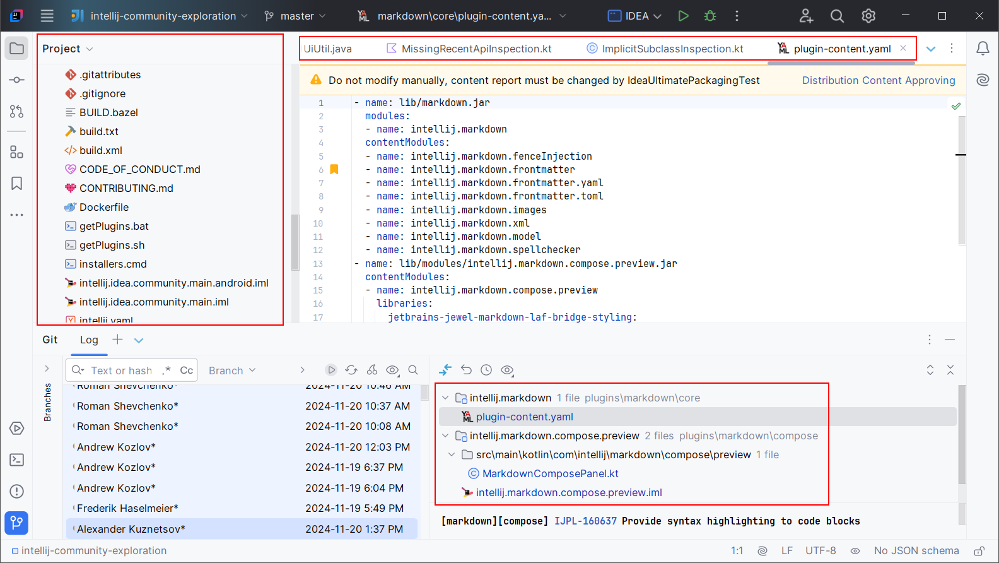

<show-structure for="chapter,procedure,tab,def"/>

# Getting Started

By default, Extra Icons override the file and folder icons in most tool windows like:

- project view
- commit view
- structure view
- bookmarks view

It also overrides the file icons in the Editor tabs, in the Diff Viewer, etc.

Here is an example:

## Capabilities

Extra Icons is fully configurable and can be used to override almost any icon in the IDE:

- select icons to override from 500+ custom icons
  - many icons have [variants](Extra-Icons-Plugin-Icons.md#alternative-icons), so if you aren't happy with an icon, you can pick another one
- register your own icons to override almost any icon in the IDE, including toolbars, menus, etc.
- import and export Icon Packs
- show a custom icon for Git submodule folders
- the [Classic UI](https://plugins.jetbrains.com/plugin/24468-classic-ui) is supported, as well as the new default UI (previously called the New UI)

> Extra Icons is fast and mature. It takes only a few milliseconds to display custom icons for hundreds of files, with a very low memory overhead.
{style="note"}
