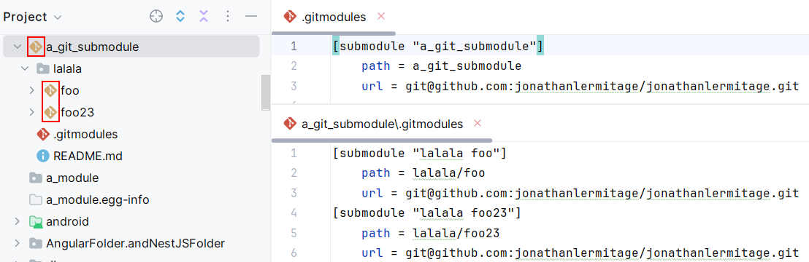
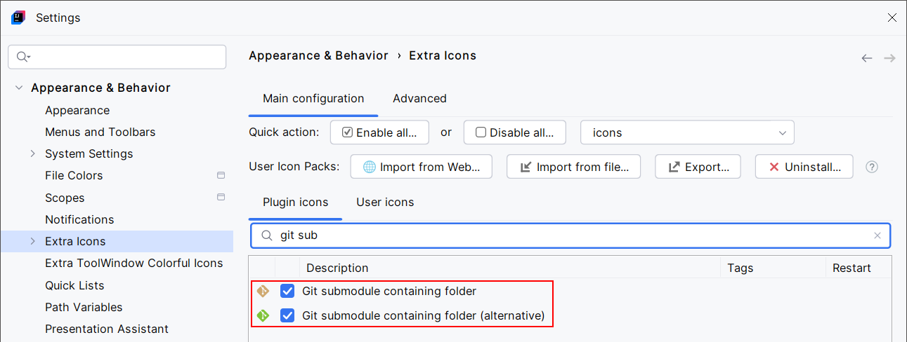

<show-structure for="chapter,procedure,tab,def"/>

# Git Submodules Icon

If your project defines some git submodules, their containing folders icon should be customized. It works with nested submodules as well. You should see beautiful golden or green Git icons:

{ width="840" }

{ width="840" }

> Submodules are detected on project loading (Extra Icons parses `.gitmodules` files only on project's load). If you check out submodules after project loading (in other words, if you create and populate submodule folders), you will have to re-open your project to see the new submodule icons. You can also trigger submodule detection and icons reloading by going to the [Advanced Configuration](Extra-Icons-Advanced-Configuration.md#button-reload-projects-icons) settings panel, then click the `Reload projects icons` button.
{title="How it works"}
