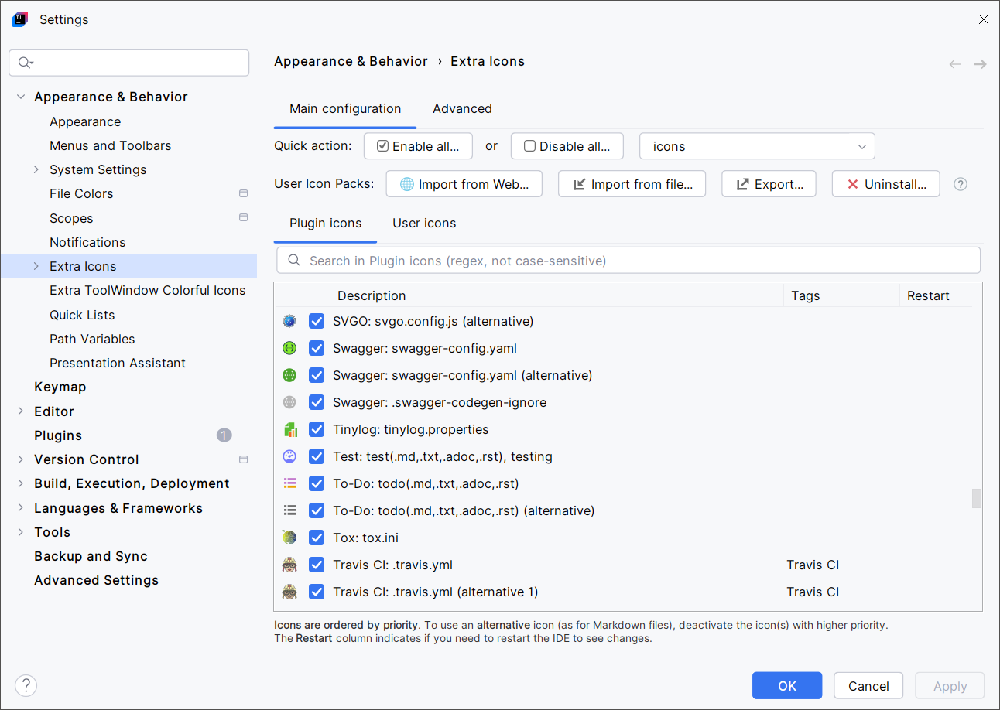

<show-structure for="chapter,procedure,tab,def"/>

# Main Configuration

Access the Extra Icons' settings panel by going to <ui-path>File | Settings | Appearance & Behavior | Extra Icons</ui-path>:

{ width="920" }
