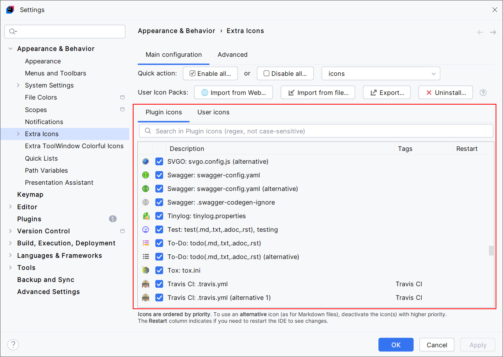
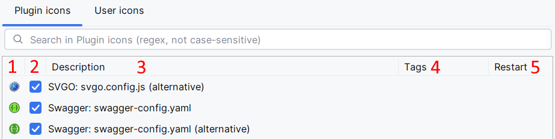
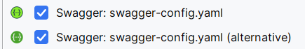
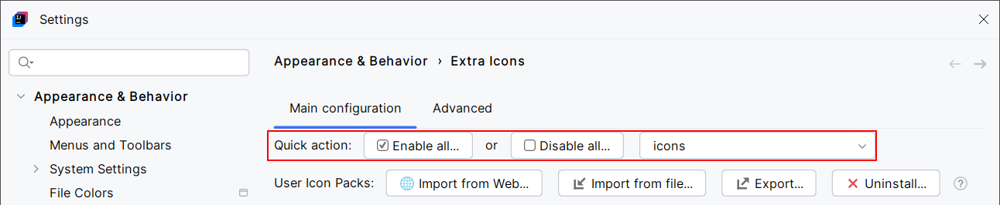
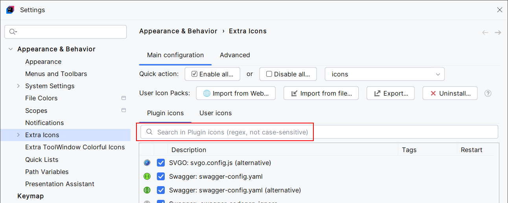

<show-structure for="chapter,procedure,tab,def"/>

# Plugin Icons

{ width="640" }{ thumbnail="true" }

Use the checkboxes in the **Plugin icons** table to enable or disable the icon override for the associated files.

This table has five columns. For each line, it shows:

{ width="640" }

1. the icon to apply
2. a checkbox that says if the icon override is enabled or not
3. a description of the rule associated to the icon override. This usually says it overrides a file icon by its name or thanks to a regular expression
4. optional tags. Some icons associated with the same technology (per example, Docker or Angular) may have the same tag. Tags are purely informational and can be used by [Quick actions](#quick-actions)
5. if you see the icon in this column, that means you need to restart your IDE to apply changes. Otherwise, changes are applied once you validate the form

## Alternative Icons

Several icon overrides have a similar description with some of them ending with "(alternative)", "(alternative 2)", etc.

Example:

{ width="350" }

In this case, Extra Icons selects the first enabled icon override for `swagger-config.yaml` files.
Otherwise:

- if you want to use the second icon, disable the first one
- if there are three icon overrides, disable the two first icons to use the third
- and so on

This way, you can choose among multiple available icons for the same icon override.

## Quick Actions

{ width="920" }

Enable or disable a group of icons by their tag, or all the icons. This applies to the Plugin icons table only. The User icons table is not affected.

This is a convenient way to enable or disable a group of icons.

## Search in Plugin Icons

{ width="920" }

Filter the **Plugin icons** table to find what you want.

This only filters the table view. It doesn't enable or disable icon overrides.
