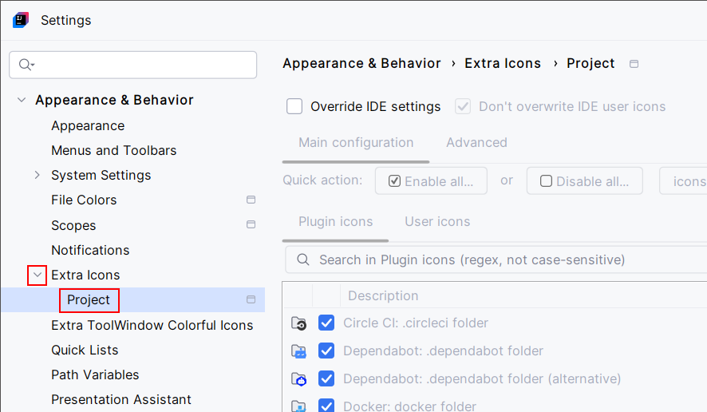

<show-structure for="chapter,procedure,tab,def"/>

# Project Level Configuration

{ width="680" }

You can enable configuration at the project level. It will optionally (there is a checkbox) override configuration at IDE level.

Project level configuration applies to the current project only.
