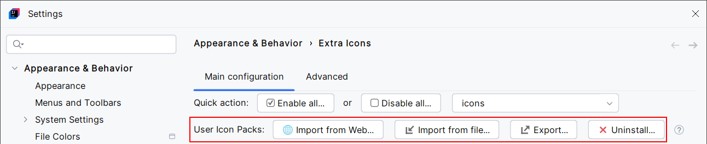

<show-structure for="chapter,procedure,tab,def"/>

# User Icon Packs

{ width="920" }

An Icon Pack is a collection of User Icons. Basically, this is a JSON file that contains Base64-encoded PNG or SVG icons (or references to icons bundled in Extra Icons) and their corresponding file icons override definitions.
An Icon Pack may also have a name.

- **Import from Web**: this button redirects to a [list of downloadable Icon Packs](https://github.com/jonathanlermitage/intellij-extra-icons-plugin/blob/master/themes/THEMES.md#downloadable-icon-packs)
- **Import from File**: install an Icon Pack
- **Export**: save the User Icons to an Icon Pack file
- **Uninstall**: remove the User Icons associated with the given Icon Pack name
