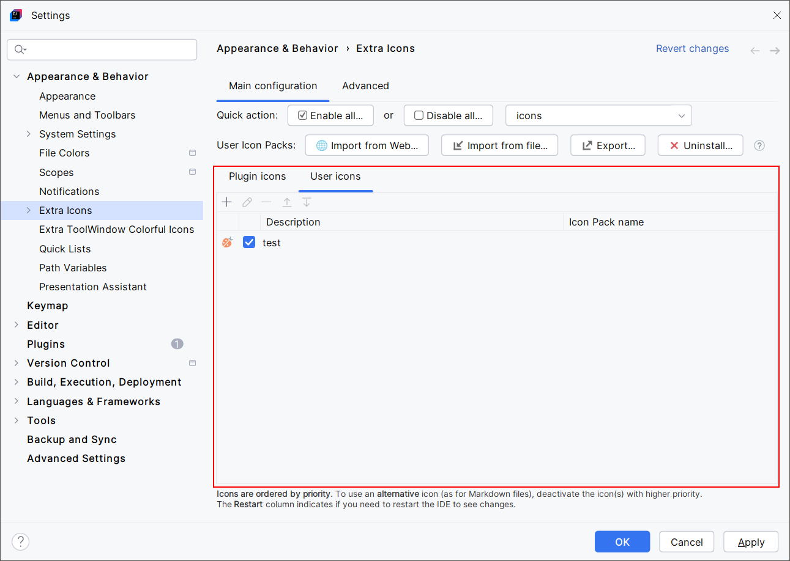
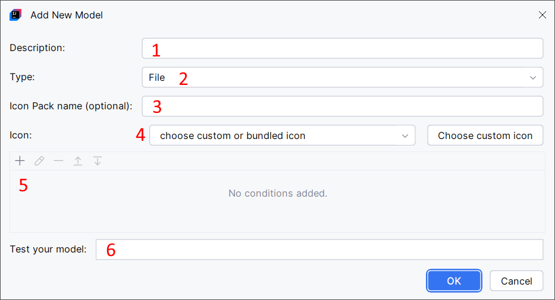
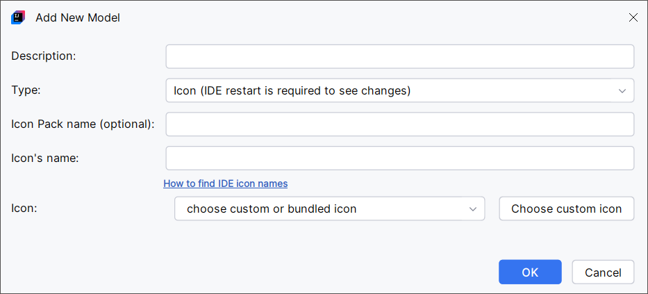
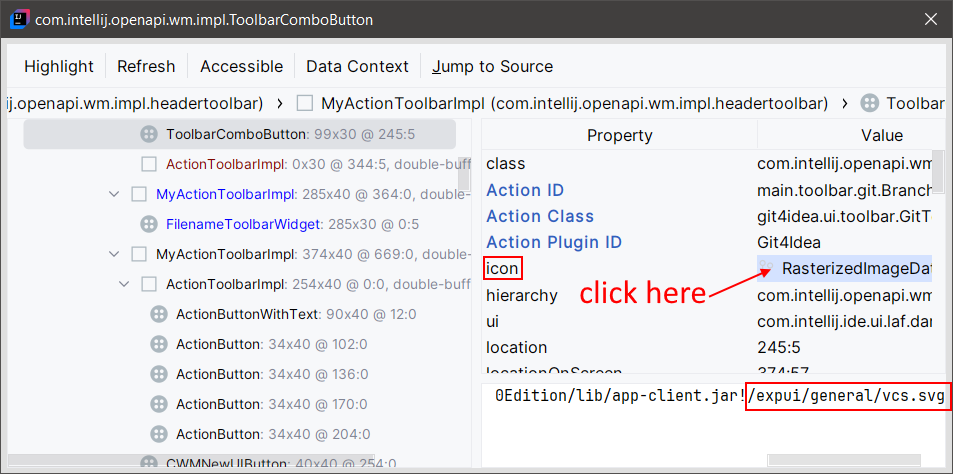
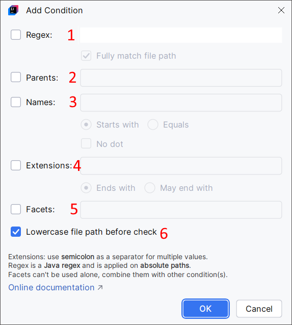

<show-structure for="chapter,procedure,tab,def"/>

# User Icons

{ width="640" }{ thumbnail="true" }

The `User icons` tab displays the icons [provided by you](#provide-your-own-icons) and the icons from imported [Icon Packs](Extra-Icons-User-Icon-Packs.md).

## Provide Your Own Icons

You can register your own custom icon to override almost every icon in the IDE.

Click the "+" symbol and a new dialog will help you.

{ width="680" }

> In Extra Icons, a "Model" is the combination of an icon and the rules that define icon override associated with this icon.

1. Description: a description for your model. This is purely informational.
2. Type: indicates if you want to override the icon for a [File](#file-icons), a [Directory](#directory-icons), or override an icon of the [IDE](#ide-icons) directly.
3. Icon Pack name: an optional name to say this model is part of an icon pack. This is purely informational.
4. Icon: the icon. You can pick an icon from Extra Icons (click the dropdown menu to see all the icons that come with Extra Icons), or click the `Choose custom icon` button to import your own PNG of SVG icon. Tip: you can browse the [beautiful icons used by JetBrains IDEs](https://intellij-icons.jetbrains.design/).
5. Conditions: click the "+" symbol to add [conditions](#conditions) to the icon override. Per example, you can say you will override all file icons with a name that ends with `.py`.
6. Test your model: type the name or the path of a file to see if your model affects it. This is useful when defining conditions based on complex regular expression. This test is optional.

> **You should be able to override every icon in the IDE**. Meanwhile, some IDEs may be affected by bugs which prevent from overriding a few icons. In this case it is recommended to open an issue or email me, and I will do the necessary to find a workaround or [open an issue](https://github.com/jonathanlermitage/intellij-extra-icons-plugin/issues) on the JetBrains side.
> Example of an IDE issue: the Python icon wasn't overridable in PyCharm. This problem has been resolved by JetBrains in the next PyCharm release.

> **You can also override icons from any third-party plugin**, but Extra Icons has to be updated first. A plugin can override the icons from another plugin, but it has to declare some priority flags to say *"Plugin A icons are more important than Plugin B icons"*.
> To proceed, give me the name of the third-party plugin. I will update Extra Icons accordingly, and I will publish a new release. After that, you should be able to override icons from the given third-party plugin.

### File Icons

This is a file, identified by its name (per example, `foo.py`) or, generally, its full path (per example, `/home/me/prj/foo.py`).
The "\" characters are replaced by "/" even on Windows. Names and paths are lowercased.

### Directory Icons

This is a directory, identified by its name (per example, `dir`) or, generally, its full path (per example, `/home/me/prj/dir`).
The "\" characters are replaced by "/" even on Windows. Names and paths are lowercased.

### IDE Icons

This is an icon of the IDE, like an icon in a menu, a toolbar, a tool window, etc. This can also be the icon for a file type (per example, for Java classes).

In this situation, the Model dialog is a bit different, as it will ask for the IDE icon path (the `Icon's name` field), and there won't be a list of conditions:

{ width="680" }

An icon is identified by its name (per example, `GrazieCloudProcessing.svg`) or its internal path (per example, `/icons/stroke/GrazieCloudProcessing.svg`).

<procedure title="Find IDE Icon Names" id="find-ide-icon-names">

You can find IDE icon names or paths by enabling the Internal Mode of your IDE:

<step>Go to `Help > Edit Custom Properties...` then add `idea.is.internal=true`.</step>
<step>Restart your IDE.</step>
<step>You can now use the UI Inspector with this combination: `Ctrl` + `Alt` + clicking on an element in the IDE. This will open a dialog showing information about the element. Click `icon` to get the icon path.</step>

In this example, I clicked on the VCS icon of the main toolbar.

{ width="700" }

Here, the icon path is `/expui/general/vcs.svg`.
If you override only `vcs.svg`, you will actually override all the icons with a path that ends with `vcs.svg`.

</procedure>

> IDE icons overrides work after having restarted the IDE.
> The other icon overrides (File and Directory icons) are applied immediately.
{style="warning"}

### Menu Action Icons

> Planned for the first release of 2025
{style="note"}

This is an icon associated with an action in a menu. For example, you can add an icon to the `right-click > Git > Rebase...` action.
You can also overwrite an action's icon if it already has one.

For icons associated with intermediate menus, JetBrains does not allow that. If you're interested in this missing feature, please upvote [IDEA-364676](https://youtrack.jetbrains.com/issue/IDEA-364676).

### Conditions

When defining a model for a [File](#file-icons) or a [Directory](#directory-icons), you will define one or many conditions under which the icon override will apply.

When defining multiple conditions in the table, the icon override will apply if at least one condition is matched.

Inside a condition (i.e., in the `Add Condition dialog`), you will define one or many rules.
When defining multiple rules, the condition will apply if all the rules are verified.

{ width="450" }

1. the file or folder path verifies the given regular expression.
2. the file or folder has the given folder name as parent.
3. the file or folder name starts with or is equal to the given string. You can also indicate the file or folder path shouldn't contain a "." character.
4. the filename ends with the given string. This rule can be made optional (enable `May end with` instead of `End with`).
5. the project or the module has the given facets. You can find the active facets in the Project Structure menu of the IDE.

> Most of the time, the conditions are verified against the file and folder full paths. Meanwhile, in certain circumstances, like with in-memory files, the conditions may be verified against the file or folder name only.
{style="warning"}

## Search for Existing JetBrains Icons

Visit [IntelliJ Platform Icons](https://intellij-icons.jetbrains.design/) and find most of the icons used by JetBrains IDEs. Click an icon, then download it as a zip file. This file will contain the icon as a PNG or SVG file, with an optional second file for dark themes (its name ends with `_dark.svg`).
