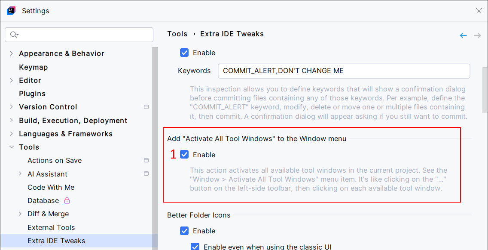
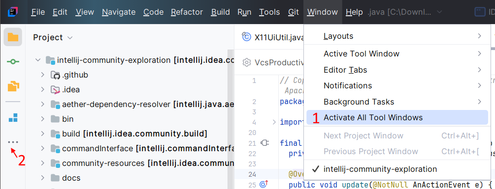

<show-structure for="chapter,procedure,tab,def"/>

# Activate All Tool Windows

This action activates all the available tool windows in the current project. Enable it in settings, then see the "Window > Activate All Tool Windows" menu item. It is like clicking on the "..." button on the left-side toolbar, then clicking on each of the available tool windows.

## Configuration

{ width="750" }

1. Enable the "Window > Activate All Tool Windows" action.

## Usage

{ width="720" }

1. The "Window > Activate All Tool Windows" action. Click it to activate all the available tool windows. It is like clicking on the "..." (2) button on the left-side toolbar, then clicking on each of the available tool windows.

> The `Run`, `Debug`, `Profile`, and `Find` tool windows are not considered as "available" tool windows.  
> This is a limitation of the IDE. This makes sense as these tool windows show content only after specific user interactions. For example, the `Run` tool window shows content only if you ran a Run configuration or a program. In this situation, this tool window is activated automatically. There is no reason to activate it when empty.
