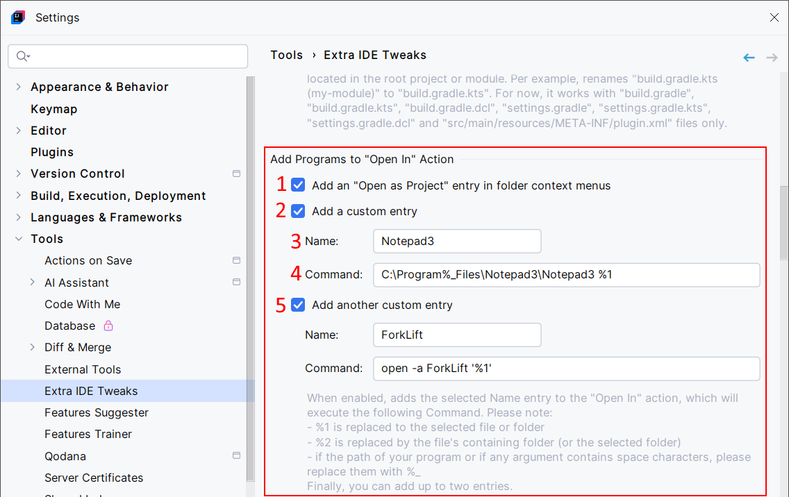

<show-structure for="chapter,procedure,tab,def"/>

# Add Programs To The "Open In" Action

Register any program and add it to the "Open In" list when doing a right-click on a file, a folder, or a project. Your program will be added next to the "Open In > Terminal" action. That means you can open files and folders with your favorite program (like ForkLift, Total Commander, Vim...). You can register up to two "Open In" actions.

## Configuration

{ width="750" }

1. Add the "Open as Project" action, which opens the given folder as a new project (similar to "File > Open", then select a folder).
2. Add a custom entry to the "Open In" action.
3. The display name of this entry. 
4. The command to invoke this entry. `%1` is replaced by the selected file or folder (absolute paths). `%2` is replaced by the containing folder if it is a file, otherwise it's similar to `%1`.
5. Add a second custom entry to the "Open In" action.

## Usage

On enabled and configured, do a right-click on a file, a folder, or a project.

{ width="690" }
