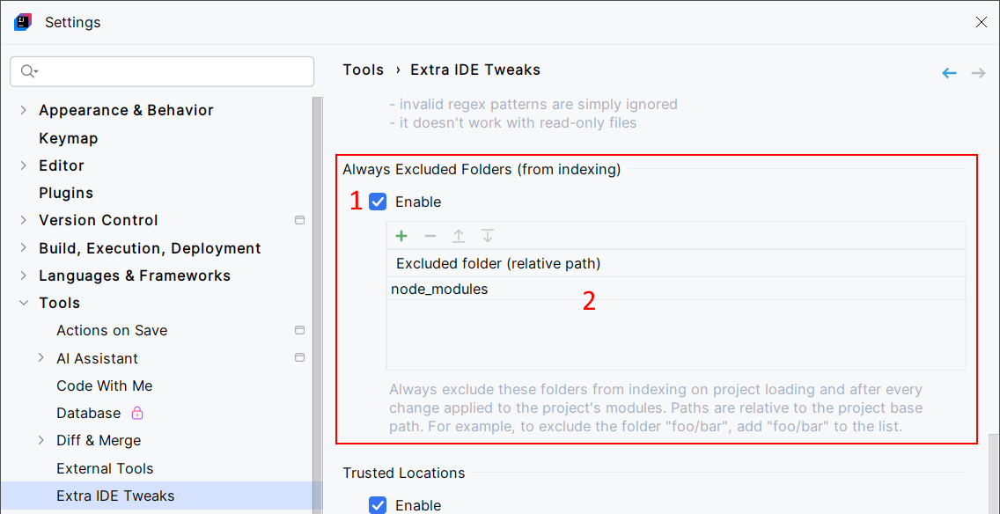
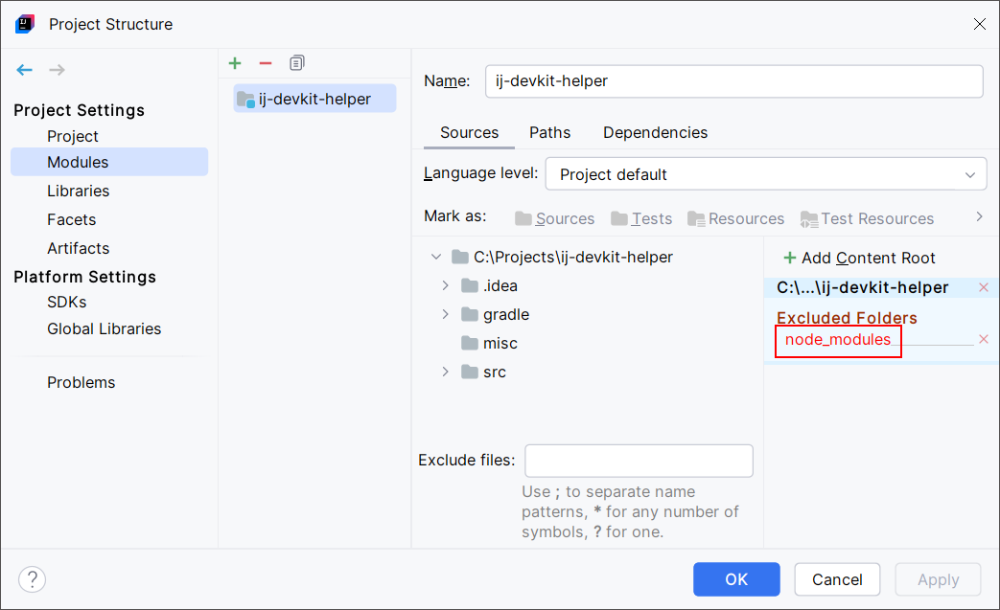

<show-structure for="chapter,procedure,tab,def"/>

# Always Excluded Folders (From Indexing)

Define default Excluded Folders (not per-project). There is now a global list of excluded folders.

## Configuration

{ width="750" }

1. Enable the Always Excluded Folders feature.
2. Add some folders to exclude from indexing (relative paths).
3. Inspired by [GitHub issue #7](https://github.com/jonathanlermitage/intellij-extra-ide-tweaks/issues/7), the Assistant dialog can help you to handle complex scenarios like large Git monorepos. This tool lets you register multiple folders to exclude from indexing. It will allow you to select a folder path and a regular expression, then it will find all the subdirectories matching the regular expression, allowing you to add them to the Always Excluded Folders list. The Assistant dialog is optional.

## Usage

The configured paths are automatically added to the excluded folders list on project loading, and to all opened projects when modifying settings.

> Modifying the list of excluded folders can take too much time if you have many modules in your project (for example, IntelliJ Community sources contain 1300 modules), which would freeze the IDE.  
> To prevent that, and starting with Extra IDE Tweaks 2025.1.15 (also included in Extra Tools Pack 2025.1.19), the Always Excluded Folders feature ignores projects with more than 100 modules.
{style="warning"}

In this example, the `node_modules` folder is automatically excluded, even if this folder doesn't exist yet.

{ width="720" }
