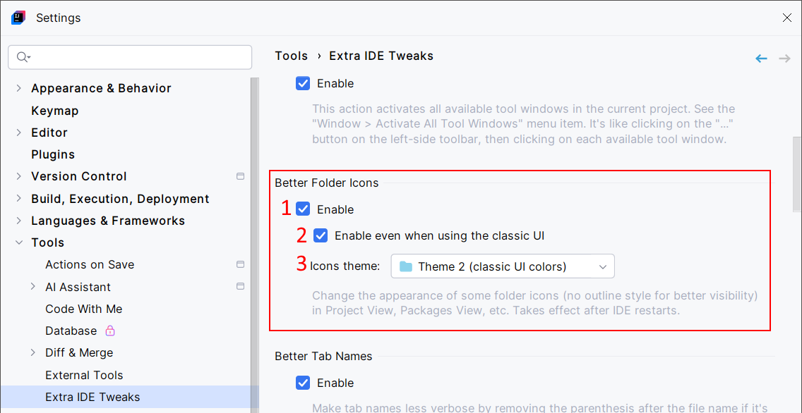
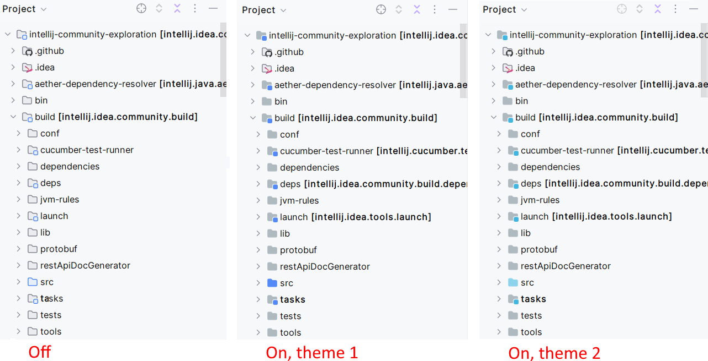

<show-structure for="chapter,procedure,tab,def"/>

# Better Folder Icons

This feature can make folder icons more visible (with no outline style) when using the New UI. You can also use it with the [Classic UI](https://plugins.jetbrains.com/plugin/24468-classic-ui).

## Configuration

{ width="750" }

1. Enable Better Folder Icons.
2. By default, Better Folder Icons is activated only when using the New UI. You can also enable it when using the [Classic UI](https://plugins.jetbrains.com/plugin/24468-classic-ui).
3. Choose a theme for folders.

> This Takes effect after the IDE restarts.

## Usage

Here is a preview of Better Folder Icons when disabled, enabled with the first theme, and enabled with the second theme:

{ width="820" }
