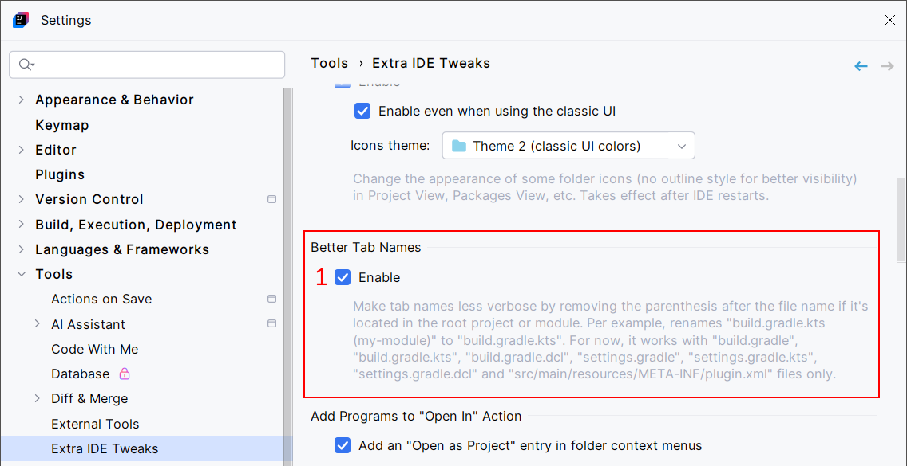
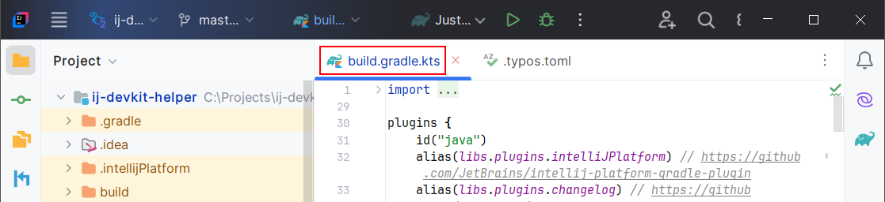
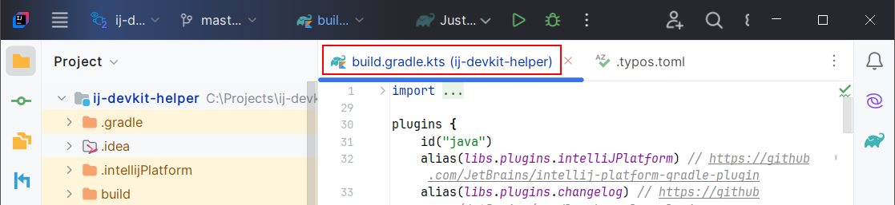

<show-structure for="chapter,procedure,tab,def"/>

# Better Tab Names

This feature can rename tab names to remove the parenthesis after the filenames if they're located in the root project or module. Per example, renames `build.gradle.kts (my-module)` to `build.gradle.kts`.

For now, it works with these files:

- `build.gradle`
- `build.gradle.kts`
- `build.gradle.dcl`
- `settings.gradle`
- `settings.gradle.kts`
- `settings.gradle.dcl`
- `src/main/resources/META-INF/plugin.xml`

Don't hesitate to [ask](Extra-IDE-Tweaks-Ask-Me-New-Features.md) for additional files.

## Configuration

{ width="750" }

1. Enable Better Tab Names.

## Usage

A preview with Better Tab Names **enabled**:

{ width="850" }

With Better Tab Names **disabled**:

{ width="850" }
