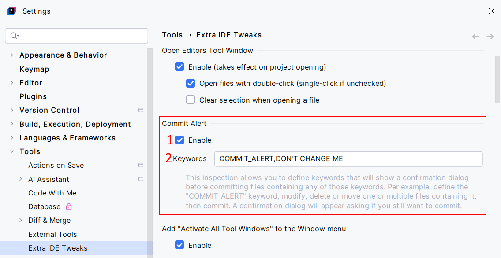
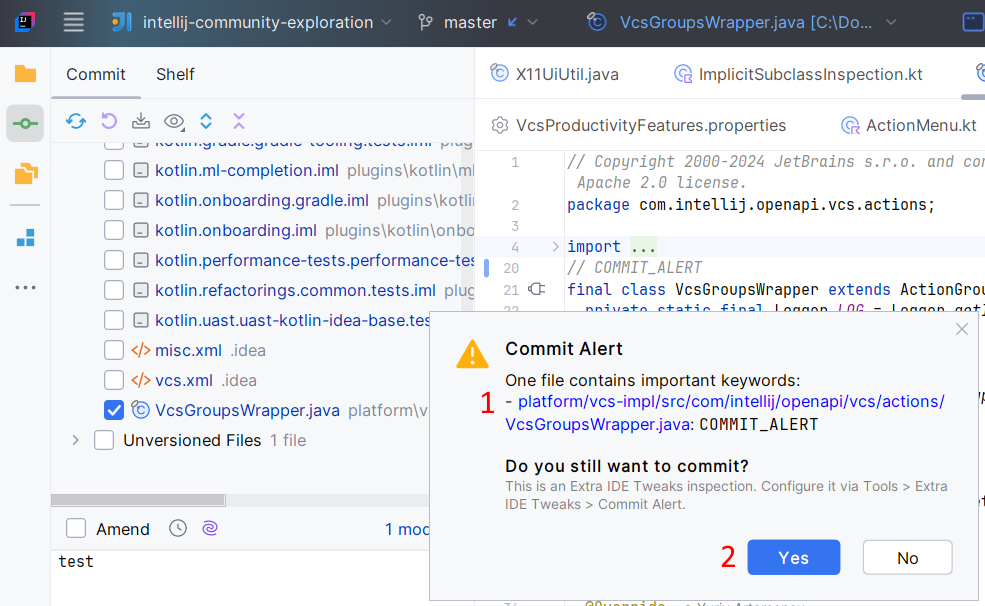

<show-structure for="chapter,procedure,tab,def"/>

# Commit Alert

This inspection allows you to define keywords that will show a confirmation dialog before committing files containing any of those keywords. Per example, define the COMMIT_ALERT keyword, modify, delete or move one or multiple files containing it, then commit. A confirmation dialog will appear asking if you still want to commit.

## Configuration

{ width="750" }

1. Enable the Commit Alert inspection.
2. Define a list of keywords separated by commas.

## Usage

{ width="750" }

Commit changes. If any affected file contains any of the keywords, a confirmation dialog will appear before the commit operation is effectively applied:

1. The list of files you want to commit but containing the keywords. For each of these files, you will see the keywords they contain. The color of the filenames reflects the changes implied by the commit: file deletion, creation, update, move.
2. Chose what to do. Yes: the commit operation will continue. No: the commit operation will be canceled.
