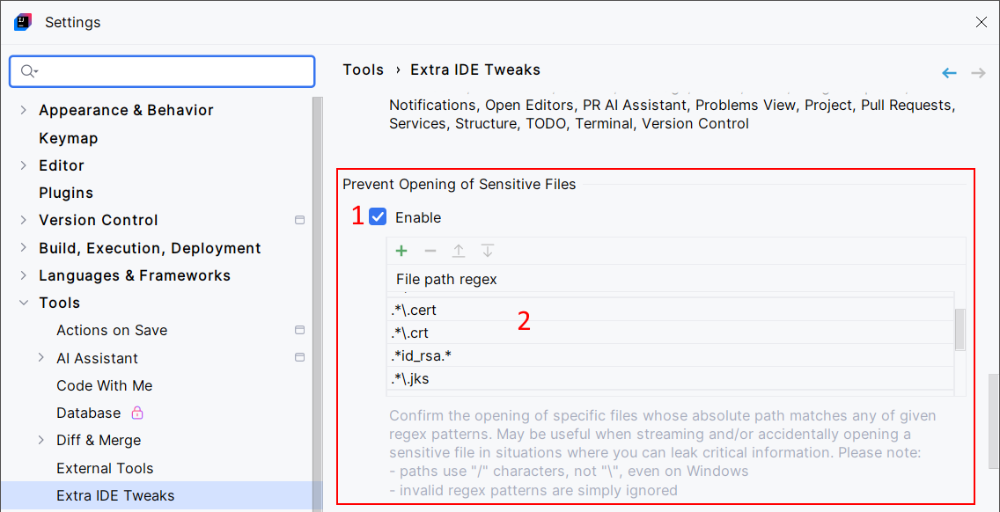

<show-structure for="chapter,procedure,tab,def"/>

# Confirm Opening of Sensitive Files

Confirm the opening of sensitive files. May be useful when streaming and/or accidentally opening a sensitive file in situations where you can leak critical information.

## Configuration

{ width="750" }

1. Enable the Confirm Opening of Sensitive Files feature.
2. Configure a list of regular expressions that defines what is considered as sensitive files. Regular expressions are case-sensitive.

> Most of the time, the regular expressions are verified against the file full paths. Meanwhile, in certain circumstances, like with in-memory files, the conditions may be verified against the file name only.

> IDEs prior to 2024.2 are affected by limitations that prevent from showing a confirmation dialog before file opening. In practice, you will see the content of the sensitive file during a few frames (in other words, a few milliseconds), then it will be closed or hidden, and the confirmation dialog will finally appear. This is a problem if you're streaming or recording your screen.
> 
> **This feature works correctly with 2024.2+ IDEs only**. With these recent IDEs, you will see an empty file instead of the actual sensitive file, then the confirmation dialog. This is fully compatible with screen streaming or recording.
{style="warning"}

## Usage

Open a sensitive file. You will see a blank file and a confirmation dialog.

- If you click "Yes", the editor will load the file's content.  
- If you click "No", the editor will close the file.

<video src="../../images/extra-ide-tweaks/extra-ide-tweaks-prevent-opening-sensitive-files.mp4" preview-src="../../images/extra-ide-tweaks/extra-ide-tweaks-prevent-opening-sensitive-files.png"/>
