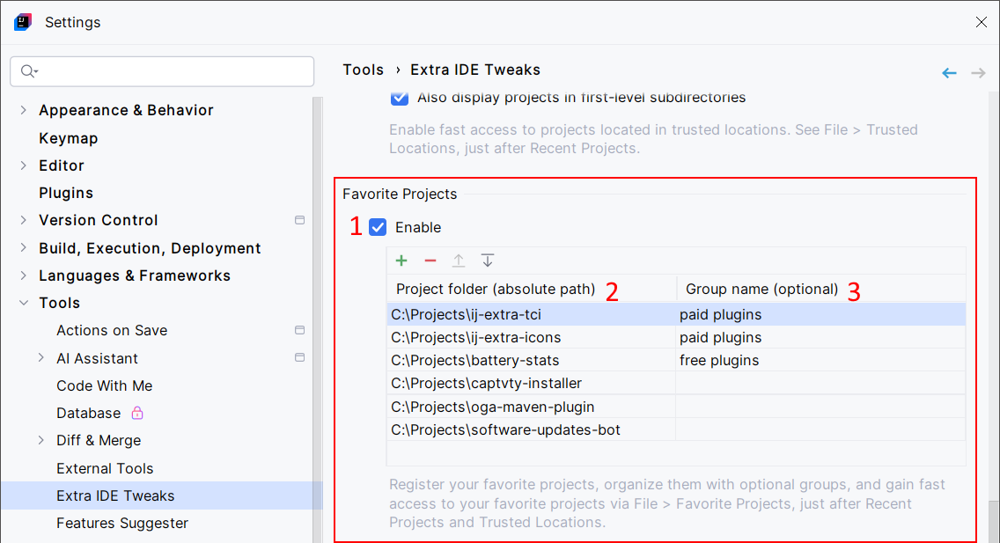
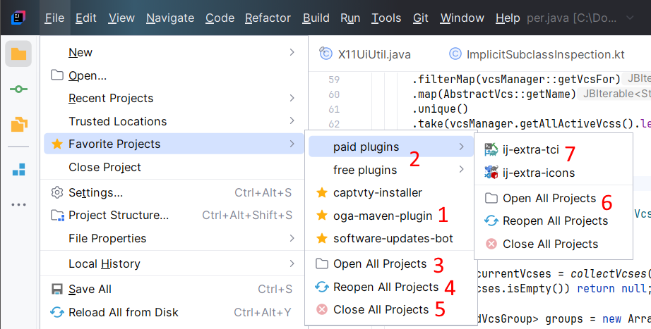

<show-structure for="chapter,procedure,tab,def"/>

# Favorite Projects

Register your favorite projects, organize them with optional groups, and gain fast access to your favorite projects via <ui-path>File | Favorite Projects</ui-path>, just after "Recent Projects" and "Trusted Locations".

## Configuration

{ width="750" }

1. Enable the Favorite Projects feature. 
2. Add your favorite projects.
3. Associate optional group name to projects. Projects in the same group will be displayed together. Group names are case-sensitive.
4. Reorder items as you want. The order or projects and groups will be preserved when displaying favorite projects.

## Usage

Once you registered some favorite projects, go to <ui-path>File | Favorite Projects</ui-path>.

{ width="700" }

1. The registered favorite projects that don't belong to any group.
2. The registered groups (here: "paid plugins" and "free plugins").
3. Open all the projects that don't belong to any group.
4. Reopen all the projects that don't belong to any group. In practice, this will close them, then open them again. This can be useful if you want to reopen several projects in a specific order.
5. Close all the projects that don't belong to any group.
6. Open, reopen, or close the projects that belong to the given group.
7. If a project contains an `.idea/icon.svg` icon file, it will be displayed in place of the default star icon.

> My personal tip: I used to regularly open the same set of projects: an API project, some Kubernetes/Helm projects, microservice projects, GitLab pipeline projects, and some miscellaneous stuff. I implemented the "Open All Projects" and "Reopen All Projects" features because I always wanted to open them in the same order. This way, I knew where each project was located exactly in <ui-path>Window | *the list of opened projects*</ui-path> or in the taskbar.

> Don't hesitate to create `.idea/icon.svg` icon files in your projects. They're displayed in the IDE's main toolbar when using the New UI. The [JetBrains ToolBox](https://www.jetbrains.com/toolbox-app/) uses it too. This is a convenient way to find your projects. 
