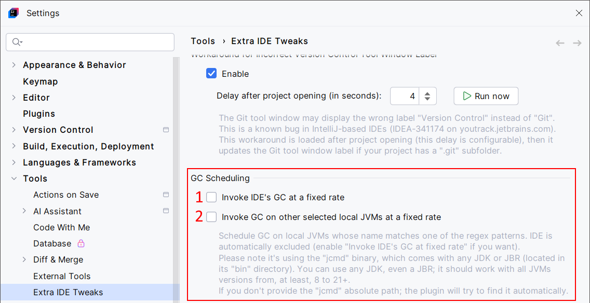

<show-structure for="chapter,procedure,tab,def"/>

# GC Scheduling

A convenient way to schedule the GC on your IDE. This is like showing the Memory Indicator, then clicking on it to trigger the GC.

You can also schedule the GC on any local JVMs. This may be useful when having multiple Gradle or Kotlin Compiler daemons consuming too much memory. You can choose to run the GC on selected JVMs: all local JVMs, or by filtering by JVM instance name with your own regular expressions.

> When running the GC on the IDE, this works by running the Java instruction: `System.gc()`.
>
> This should always work unless you explicitly disabled the support for running `System.gc()` on your IDE, for example, via the `DisableExplicitGC` JVM option.

> When running the GC on local JVMs, [JMX](https://en.wikipedia.org/wiki/Java_Management_Extensions) is used to list all the running JVMs, their display name, and their PID. After that, the `jcmd` command is used to trigger the GC on selected JVMs: `jcmd 1234 GC.run` (where `1234` is the PID of the running JVM). We use the `jcmd` from the JBR (JetBrains Runtime) that runs your IDE. If no JBR is found, and if you're running Linux or macOS, we try to find a `jcmd` executable by running the `locate` command. You can also give the absolute path of a `jcmd` executable.
>
> This should always work unless you enabled some specific security rules affecting JMX, `jcmd` or `locate`.

## Configuration

{ width="750" }

1. Schedule the GC on your IDE.
2. Select the frequency on the GC on your IDE.
3. Schedule the GC on local JVMs.
4. Select the frequency on the GC on local JVMs.
5. Find the display name of the running local JVMs. This will help you to define your own regular expression in `6.`.
6. The GC will run on local JVMs if their display name matches the given regular expressions. Tip: if you want to run the GC on all the running JVMs, you may want to define the `.*` regular expression.
7. If you leave this field empty, the GC Scheduling feature will try to find the `jcmd` executable automatically (it won't fill the field). Meanwhile, you can still define the path of `jcmd`. Keep in mind that if the path is wrong, no GC will be executed. Before setting this field, you should check if a `jcmd` is already accessible (`9.`).
8. This button can try to locate the `jcmd` executable.
9. Verify if the GC Scheduling feature can access `jcmd`, depending on whether you've let it find `jcmd` automatically or whether you've defined its path manually.

## Usage

The GC is automatically triggered according to the configuration.
