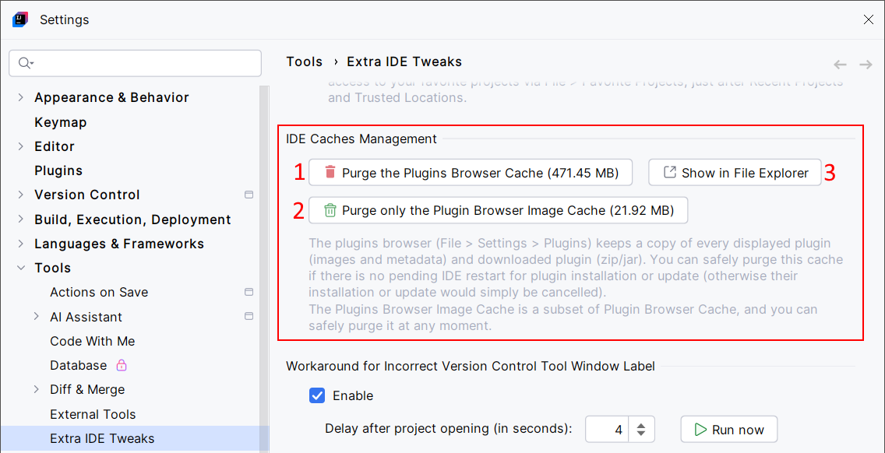

<show-structure for="chapter,procedure,tab,def"/>

# IDE Caches Management

Purge IDE's plugins browser download cache. This is a workaround for known IDE limitation 🐛 [IJPL-6179](https://youtrack.jetbrains.com/issue/IJPL-6179/).

Basically, every time you download and install a plugin, and every time you visit the plugin browser, the IDE stores elements (plugin files, images, metadata, etc.) in its cache. Unfortunately, it can grow up and take too much space on your machine.  
The IDE Caches Management feature offers a convenient way to handle this issue.

## Configuration

{ width="750" }

## Usage

1. Clear the IDE's plugins browser download cache.
2. If you're curious, this opens the IDE's plugins browser download cache directory in your file manager.
3. When selected, the IDE's plugins browser download cache will be checked on IDE start, then every 24 hours. If the cache is too large, a notification will offer you to clear the cache.
4. When the checkbox (3.) is selected, the notification will show only if the cache size exceeds the specified size. Example: { width="340" style="block" }

> The estimated size of the IDE's plugins browser download cache is smaller than the actual folder size, as some files are retained during cleanup: pending plugin installation files, as well as certain files that would be automatically recreated by the IDE: `brokenPlugins.json`, `brokenPlugins.json.etag`, `jbPluginsXMLIds.json`, `jbPluginsXMLIds.json.etag`, `pluginsXMLIds.json`, and `pluginsXMLIds.json.etag`.
