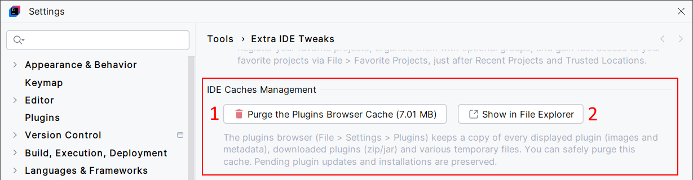

<show-structure for="chapter,procedure,tab,def"/>

# IDE Caches Management

Purge IDE's plugin download cache, or its image cache only. This is a workaround for known IDE limitation 🐛 [IJPL-6179](https://youtrack.jetbrains.com/issue/IJPL-6179/).

Basically, every time you download and install a plugin, and every time you visit the plugin browser, the IDE stores elements (plugin files, images, metadata, etc.) in its cache. Unfortunately, it can grow up and take too much space on your machine.  
The IDE Caches Management feature offers a convenient way to handle this issue.

## Configuration

No configuration is needed.

## Usage

{ width="750" }

1. Clear the IDE's plugin download cache.
2. Clear the image cache only.
3. If you're curious, this opens the IDE's plugin download cache directory in your file manager.
