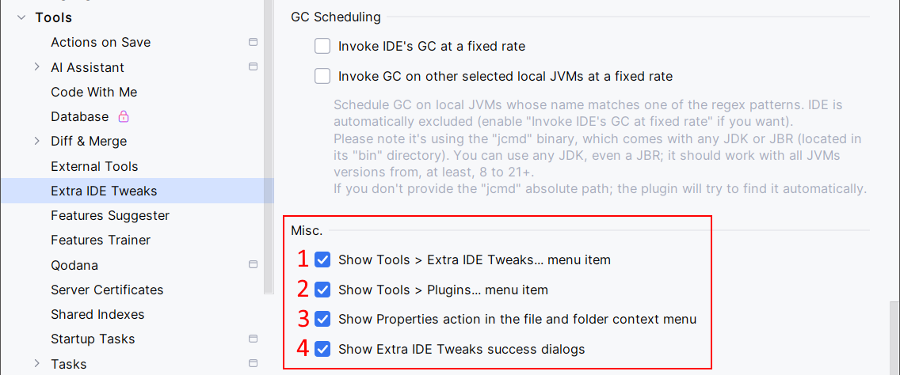

<show-structure for="chapter,procedure,tab,def"/>

# Misc. Features

{ width="750" }

1. Enable fast access to the Extra IDE Tweaks settings panel by adding a <ui-path>Tools | Extra IDE Tweaks</ui-path> menu item.
2. Enable fast access to the IDE Plugins panel (similar to going to <ui-path>File | Settings | Plugins | Installed</ui-path>) by adding a <ui-path>Tools | Plugins</ui-path> menu item. This is useful when using the [Classic UI](https://plugins.jetbrains.com/plugin/24468-classic-ui). The New UI already has a shortcut in the main toolbar (check the cog icon on the right).  
3. Enable the Properties feature. Do a right-click on a file or on a folder, then select Properties. This will display information about the given file or folder, like its size, number of elements (if a folder), creation and modification date, and its absolute path.
4. Extra IDE Tweaks may show success dialogs after some actions (for example, after having cleared the IDE's cache). Disable if to hide these informational messages.
