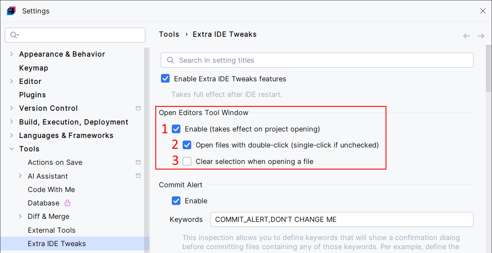
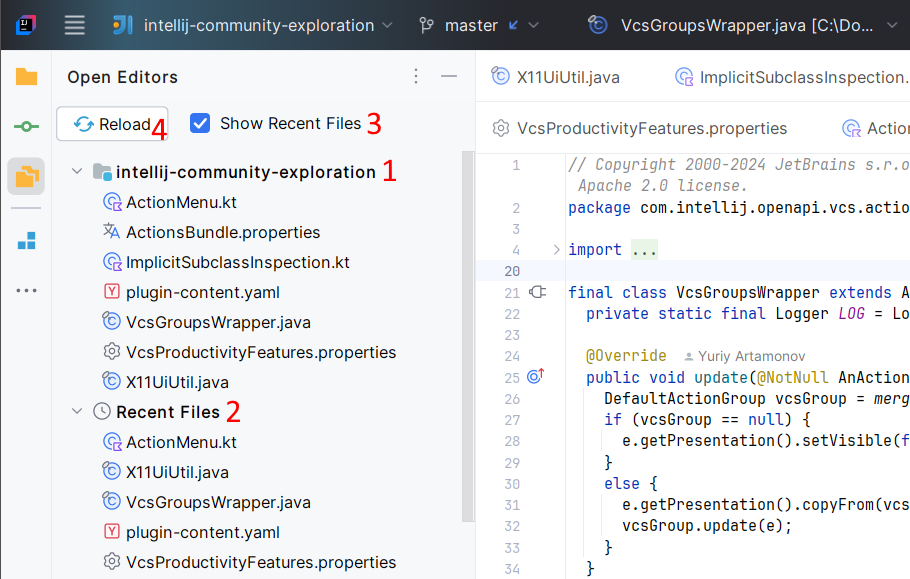

<show-structure for="chapter,procedure,tab,def"/>

# Open Editors

The Open Editors tool window shows opened files in all editors belonging to the opened project, as in VSCode. It can also display a list of recently opened files, as in the Recent Files action.

## Configuration

{ width="750" }

1. Enable the Open Editors feature.
2. Choose how to open files from the Open Editors tool window.
3. Choose if you want to clear the selection in the Open Editors tool window when you open a file.

## Usage

{ width="700" }

1. The Open Editors view shows opened files in all editors belonging to the opened project. That means you can split your IDE into multiple windows: the Open Editors lets you view and open files of your project in any window.
2. Optional and not activated by default: the Recent Files view is similar to the Recent Files popup (Ctrl + E). Use it to gain fast access to recent files.
3. The checkbox that activates and deactivates the Recent Files view.
4. Reload the Open Editors and Recent Files views. These views will be updated automatically, but they may not be updated in some very rare circumstances. You shouldn't have to use this button.
