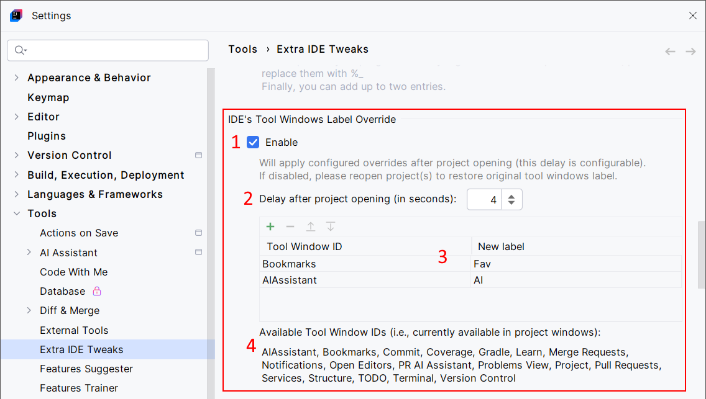

<show-structure for="chapter,procedure,tab,def"/>

# Tool Windows Label Override

Change most tool windows label. Per example, rename the "Bookmarks" tool window to "Fav".

## Configuration

{ width="750" }

1. Enable the Tool Windows Label Override feature.
2. Apply a delay before changing tool window labels. This is required to change these labels after they actually have been initialized. If thi delay is too short, the IDE will set the default labels after the Tool Windows Label Override feature has been applied. Four seconds should be enough.
3. For each tool window you want to override the label, set the tool window ID, and the new label.
4. Tool window IDs aren't easy to find, so get them from this list. This list is populated by getting the IDS of all the available tool windows for the currently opened projects. IDs are case-sensitive.

## Usage

In this example, the tool window labels are displayed (right-click, "Show Tool Window Names"), and the "Bookmarks" tool window has been renamed to "Fav", and "AI Assistant" to "AI".  

{ width="690" }

This also works with the [Classic UI](https://plugins.jetbrains.com/plugin/24468-classic-ui).

{ width="690" }
