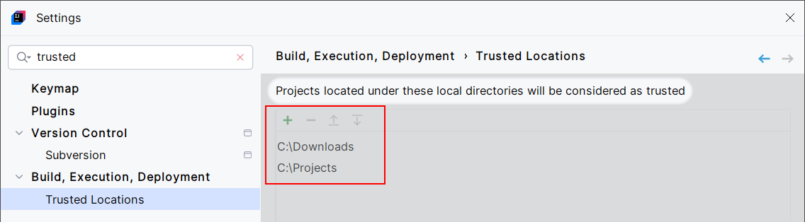
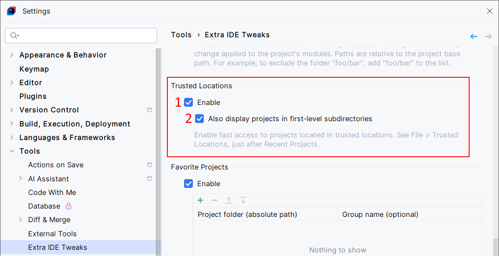
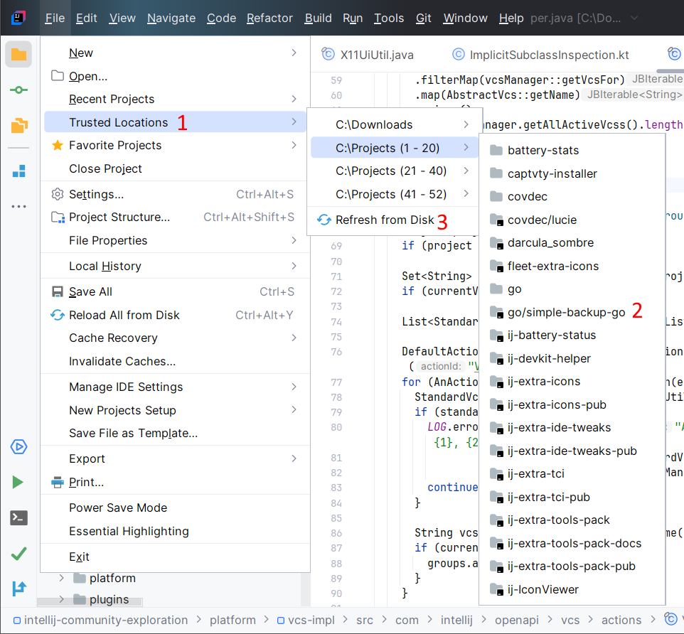
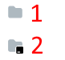

<show-structure for="chapter,procedure,tab,def"/>

# Trusted Locations

Open projects located in trusted locations directly via "File > Trusted Locations", just after "Recent Projects".

In other words, you can get fast access to projects located in folders you registered as trusted locations:

{ width="750" }

## Configuration

{ width="750" }

1. Enable the Trusted Locations feature.
2. By default, the Trusted Locations feature looks for projects in the root of each trusted location. You can also choose to look for projects located a bit deeper, in the first-level subdirectories.

## Usage

{ width="700" }

1. Access the trusted locations. If a trusted location has too many child folders, the view will be paginated.
2. If you configure Trusted Location to show first-level subdirectories, you will see the directory, then the first-level subdirectories. 
3. The list of trusted locations is cached for a short duration, for performance reasons. So, if you created a new project recently and if you don't see it, you may want to refresh the cache.

You will see two kinds of folder icons:

{ width="60" }

1. Folders.
2. Projects. A project folder is marked as a project if it contains an `.idea/` subdirectory, which usually means you've opened this project at least once in the past.
