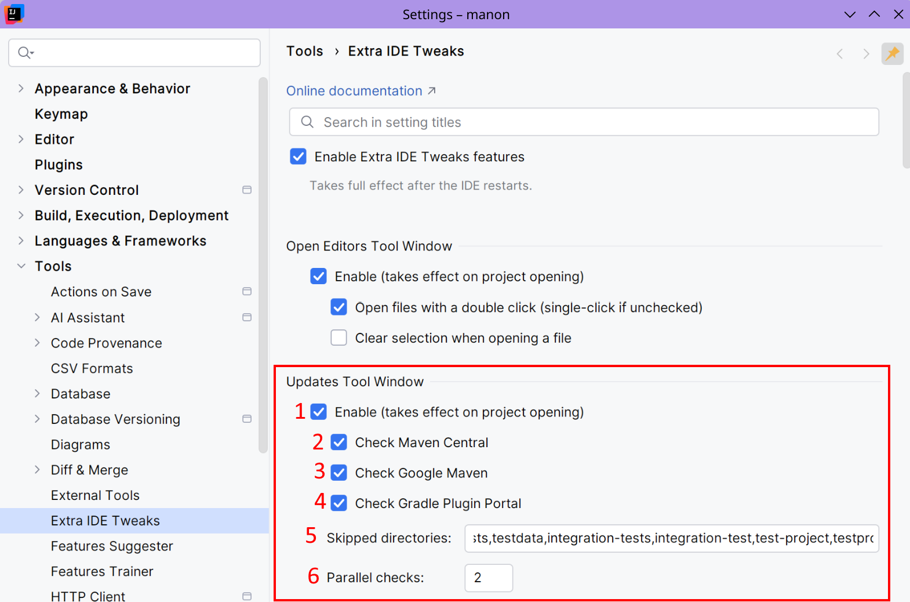
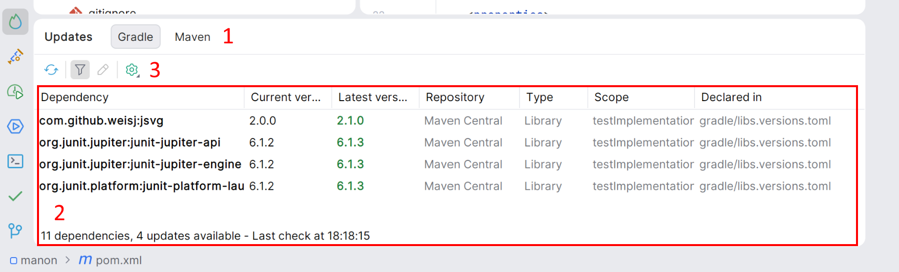

<show-structure for="chapter,procedure,tab,def"/>

# Updates Tool Window (experimental)

The Updates tool window finds updates for:
- Gradle project, like libraries and Gradle plugins, whether they are declared in build scripts or in a version catalog - with their current version and the latest version available online.
- Maven project: it lists the dependencies read from the `pom.xml` files - libraries, BOMs, Maven plugins, build extensions, the parent POM, and the Maven distribution pinned by the Maven wrapper - with their current version and the latest version available online.  

You can check for updates on demand and on project opening.

I may add support for other build systems (including non-Java) later.

## Configuration

{ width="750" }

1. Enable the Updates tool window feature.
2. Choose to find updates from Maven Central.
3. Choose to find updates from Google Maven (useful for Android projects).
4. Choose to find updates from Gradle Plugin Portal.
5. Some directories are ignored by default in order to speed up build scripts detection. If empty, a default list will be used.
6. The number of parallel HTTP queries to do when checking for updates.

The Updates tool window will also detect custom Maven repositories and use them where possible. For now, it does not support any authentication methods.

## Usage

{ width="700" }

1. The Updates tool window shows updates for Gradle and Maven projects. If the current project contains Gradle files, a Maven tab is displayed. If the current project contains Maven files, a Maven tab is displayed. If both build tools are detected, both tabs are displayed. If no compatible build tools are detected, the Updates tool window does not appear.
2. A list of detected libraries and plugins, showing their current version and the latest available version, where applicable. You can double-click on a row to view its declaration.
3. Using this toolbar, you can check for updates, filter libraries and plugins to display only those with updates, and access a declaration. The cog icon allows you to search for pre-release versions and check for updates whilst the project is loading. When you check for updates on opening the project, a notification appears with a summary of the available updates.
