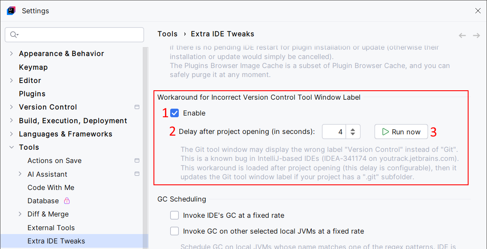

<show-structure for="chapter,procedure,tab,def"/>

# Workaround for Wrong "Version Control" Label

Workaround for known IDE issue 🐛 [IDEA-341174](https://youtrack.jetbrains.com/issue/IDEA-341174/Wrong-label-for-the-Git-toolwindow): the Git tool window may display the wrong label "Version Control" instead of "Git". This can happen with older versions of IDEs.

The IDE should detect that there is a Git repository after a brief delay. Meanwhile, this can fail due to IDEA-341174, and it may rename the tool window to "Version Control" a second time. The idea of the workaround is to detect the Git repository a bit later, then rename the tool window again.  
This is basically what can happen:

- The project is opened, and the tool window is named "Version Control".
- After a brief delay, the IDE fails to detect the presence of a git repository; then it renames the tool window to "Version Control".
- A bit later, the workaround is applied: it checks for the Git repository; then it renames the tool window to "Git" if needed.

## Configuration

{ width="750" }

1. Enable the workaround.
2. The delay before applying the workaround. This should always work with 4 seconds. If you define a too short delay, the workaround may be applied before the IDE renames the tool window to "Version Control".

## Usage

No action is needed. The "Version Control" tool window is automatically renamed to "Git" if a `.git/` subdirectory is detected.
