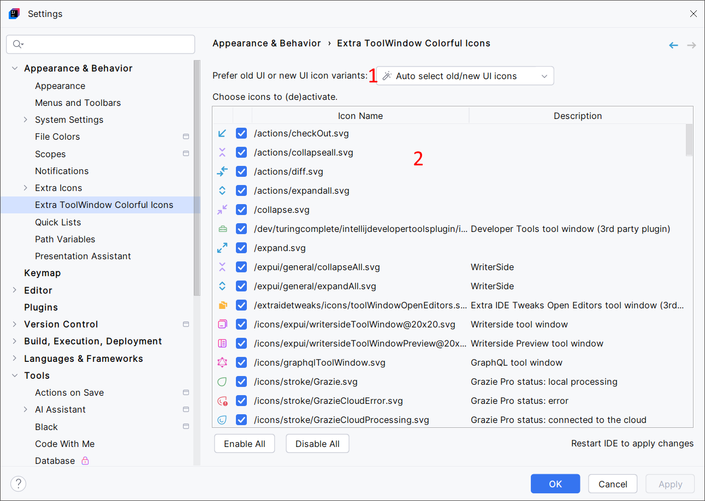

<show-structure for="chapter,procedure,tab,def"/>

# Configuration

Access the Extra ToolWindow Colorful Icons' settings panel by going to <ui-path>File | Settings | Appearance & Behavior | Extra ToolWindow Colorful Icons</ui-path>:

{ width="920" }

1. Several icons exist for both the [Classic UI](https://plugins.jetbrains.com/plugin/24468-classic-ui) and the New UI. They're selected automatically by detecting the UI type. You can use this setting to force the selection of the Classic UI or the New UI variants of icons from Extra ToolWindow Colorful Icons.
2. Choose which icons to replace. Takes effect after the IDE restarts.

> Some icons are marked as "alternative" icons. This is similar to the [alternative icons feature from Extra Icons](Extra-Icons-Plugin-Icons.md#alternative-icons).
