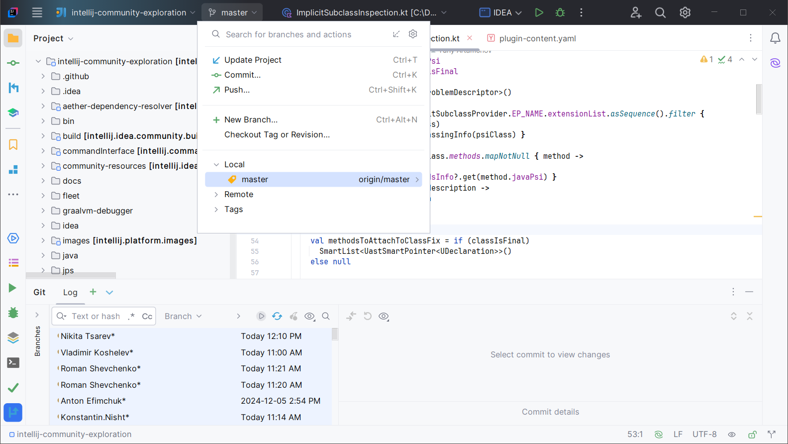
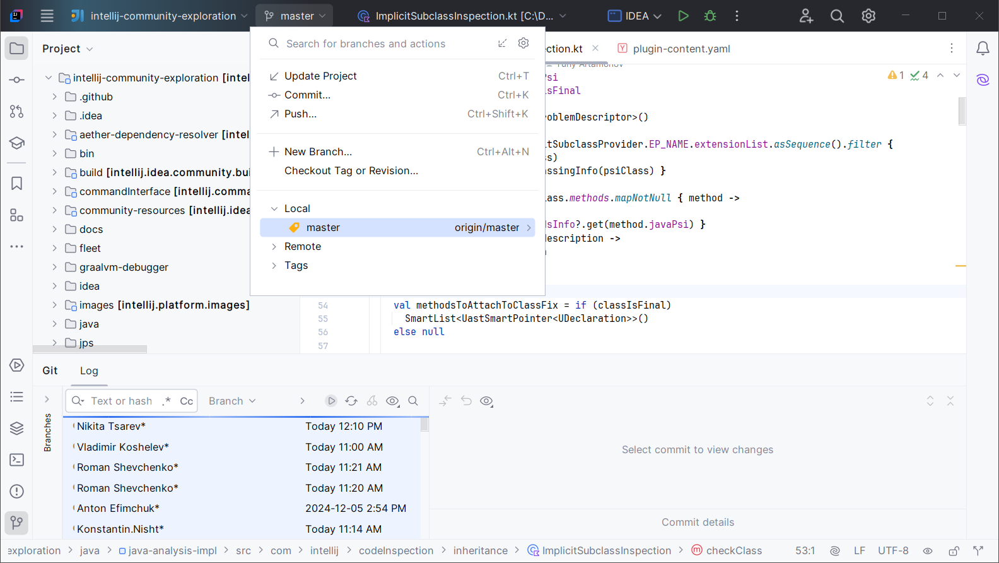

<show-structure for="chapter,procedure,tab,def"/>

# Getting Started

Extra ToolWindow Colorful Icons replaces the icons most graphical elements like:

- tool windows
- toolbars
- dialogs
- menus

Here is an example:

> This works for both the [Classic UI](https://plugins.jetbrains.com/plugin/24468-classic-ui) and the New UI.
{style="note"}

As a reminder, the same screen **without** Extra ToolWindow Colorful Icons:

## Capabilities

Extra ToolWindow Colorful Icons is configurable and can be used to choose which icons to replace.

> Extra ToolWindow Colorful Icons is fast and mature. There is no overhead when replacing these icons.
{style="note"}

> Due to limitations of the JetBrains APIs, you may have to restart your IDE twice the first time you acquire a paid license. This scenario may happen one time only. Most users shouldn't face this issue. I apologize for the inconvenience.
{style="warning"}
